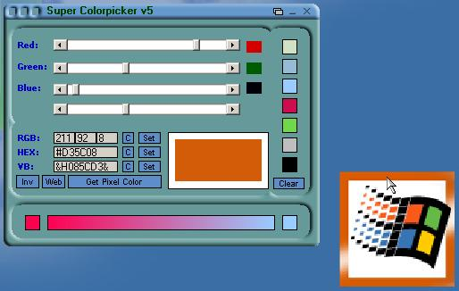



## A Super Colorpicker v5

### Description

A new version of my colorpicker. With this tool you can grab a color anywhere of the screen and see the VB colorcode, HEX value and the RGB value of it. You can convert any colorcode to another. Or making a color lighter or darker. Great tool for webdesigners...

New to this version:

- Saveslots are saved in the registry, so after closing the tool the colors are saved.

- Converting the choosen color to the closest websave color.

- Inverting a color, getting the negative of it.

- Copy colorcode to clipboard button

- Some minor bugs.

If you like my tool, please vote...
 
### More Info
 

             |
---                |---
**Submitted On**   |2004-03-29 21:06:52
**By**             |[Wwward](https://github.com/Planet-Source-Code/PSCIndex/blob/master/ByAuthor/wwward.md)
**Level**          |Advanced
**User Rating**    |4.1 (45 globes from 11 users)
**Compatibility**  |VB 6\.0
**Category**       |[Graphics](https://github.com/Planet-Source-Code/PSCIndex/blob/master/ByCategory/graphics__1-46.md)
**World**          |[Visual Basic](https://github.com/Planet-Source-Code/PSCIndex/blob/master/ByWorld/visual-basic.md)
**Archive File**   |[A\_Super\_Co172882452004\.zip](https://github.com/Planet-Source-Code/wwward-a-super-colorpicker-v5__1-52881/archive/master.zip)

